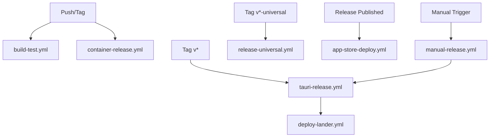

# GitHub Actions Workflows

This directory contains all GitHub Actions workflows for the ElizaOS project.

## Build & Test Workflows

### build-test.yml
- **Trigger**: Push to main, PRs, manual
- **Purpose**: Builds and tests the Tauri application across all platforms
- **Platforms**: Windows, macOS, Linux

### verify-deployment.yml
- **Trigger**: Push, PRs, manual
- **Purpose**: Verifies deployment scripts and configurations

## Release Workflows

### tauri-release.yml
- **Trigger**: Push tags (`v*`), manual
- **Purpose**: Main release workflow for desktop applications
- **Outputs**: DMG (macOS), MSI/EXE (Windows), AppImage/DEB (Linux)
- **Features**: Code signing, notarization, automatic GitHub release creation

### release-universal.yml
- **Trigger**: Push tags (`v*-universal`), manual
- **Purpose**: Builds universal macOS binary (Intel + Apple Silicon)
- **Output**: Universal DMG and app bundle

### container-release.yml
- **Trigger**: Push to main, tags (`v*`), PRs
- **Purpose**: Builds and pushes Docker containers
- **Registry**: GitHub Container Registry (ghcr.io)
- **Platforms**: linux/amd64, linux/arm64

### app-store-deploy.yml
- **Trigger**: Release published, manual
- **Purpose**: Deploys to various app stores
- **Platforms**:
  - Steam (via Steamworks)
  - Microsoft Store (MSIX)
  - Mac App Store (PKG)
  - Snap Store (snap)
  - Flathub (flatpak)

## Deployment Workflows

### deploy-lander.yml
- **Trigger**: Push to main (lander changes), manual
- **Purpose**: Deploys the landing page to GitHub Pages

### manual-release.yml
- **Trigger**: Manual only
- **Purpose**: Triggers a release build with custom version

## Required Secrets

### Code Signing
- **macOS**: 
  - `MACOS_CERTIFICATE` - P12 certificate
  - `MACOS_CERTIFICATE_PASSWORD`
  - `MACOS_KEYCHAIN_PASSWORD`
  - `APPLE_SIGNING_IDENTITY`
  - `APPLE_PROVIDER_SHORT_NAME`
  - `APPLE_ID` - Apple ID email
  - `APPLE_APP_PASSWORD` - App-specific password
  - `APPLE_TEAM_ID`
  - `APPLE_CERTIFICATES_P12`
  - `APPLE_CERTIFICATES_PASSWORD`
  - `APPLE_PROVISIONING_PROFILE`

- **Windows**:
  - `WINDOWS_CERTIFICATE` - PFX certificate
  - `WINDOWS_CERTIFICATE_PASSWORD`

### App Store Deployment
- **Steam**:
  - `STEAM_USERNAME`
  - `STEAM_PASSWORD`
  - `STEAM_APP_ID`
  - `STEAM_CONFIG_VDF`

- **Microsoft Store**:
  - `MS_TENANT_ID` - Azure AD tenant ID
  - `MS_CLIENT_ID` - Azure AD app client ID
  - `MS_CLIENT_SECRET` - Azure AD app client secret
  - `MS_PRODUCT_ID` - Microsoft Store product ID
  - `MS_PACKAGE_NAME` - Package identity name
  - `MS_PUBLISHER` - Publisher identity (CN=...)
  - `MS_PUBLISHER_DISPLAY` - Publisher display name
  - `MS_CERTIFICATE_PATH` - Path to code signing certificate
  - `MS_CERTIFICATE_PASSWORD` - Certificate password

- **Linux Stores**:
  - `SNAPCRAFT_STORE_CREDENTIALS`

### Other
- `GITHUB_TOKEN` - Automatically provided

## Workflow Dependencies

## Best Practices

1. **Version Tags**: Use semantic versioning (e.g., `v1.0.0`)
2. **Universal Builds**: Tag with `-universal` suffix for macOS universal binaries
3. **Draft Releases**: Test workflows with draft releases first
4. **Secret Management**: Use GitHub environments for production secrets
5. **Caching**: Workflows use caching for dependencies and build artifacts

## Troubleshooting

### Build Failures
- Check platform-specific dependencies
- Verify all secrets are set correctly
- Review build logs for missing tools

### Release Issues
- Ensure tags follow correct format
- Check GitHub token permissions
- Verify artifact paths match

### App Store Deployment
- Validate credentials before deployment
- Test with development/sandbox environments first
- Monitor platform-specific requirements